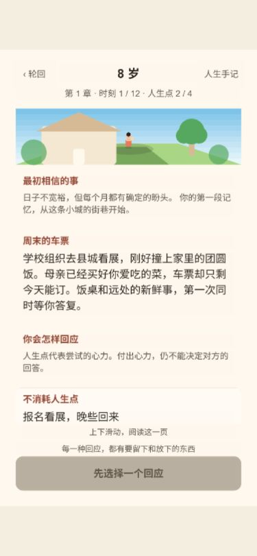

# 本轮整改与验收记录

日期：2026-09-07。规则版本：7。针对 Grok 实施后出现的过早结束、选择与经历表达混乱、界面排版失序三项问题完成本轮整改。

## 问题与根因

| 问题 | 实际原因 | 本轮处理 |
| --- | --- | --- |
| 一分钟就结束 | 原收束条件只考虑下一年到期安排；抽样人生全部在第 6 次遭遇、22—26 岁结束 | 改成四章、十二个关键时刻，从 8 岁走到 81 岁；第 3、9 次后回望 |
| 选择没有分量、过程跳跃 | 提交即跳转，结果不可见；回望重复拿最近碎片匹配少数种子；不同理解经常产生相同作用 | 每次回应停在独立结果页；两段同主题事实提供证据；新理解影响相关成本或具体追问 |
| 经历文案不完整 | 结果中的人物占位符未替换，事件、结果、解释缺少区别 | 重写 30 场遭遇和 24 个追问；结果与后果使用实际人物；晚期回望有新的理解文本 |
| UI 混乱 | 固定坐标、过宽点击区、卡片截断、档案条目截取、缺少逐层返回 | 按内容测量、完整滚动叙事、固定确认区、独立来源入口、全部手记、真正返回调用层 |
| 开局 / 发布版报错 | Cocos 将可迭代对象展开编译为 concat；构建还漏掉 Mask 与 Tween | Set/Map 使用 Array.from；补齐两端模块；增加直接运行压缩发布包的验证 |

## 最终行为

1. 四章分别覆盖 8/13/17、22/29/36、44/51/59、66/73/81 岁。每次选择都有明确结果，玩家继续后才跳时间。
2. 选择说明具体行动及其代价。花点代表尝试，邀约可能落空、协商可能被拒。免费选择始终至少两种。
3. 延迟后果通过真实碎片 ID 回连。旧订单、早年去留、加单安排分别能影响之后的合作、照料与托付。
4. 回望保留事实，新增理解版本。保留理解、修订理解、留下疑问有不同的后续作用；晚期理解会结合新证据继续变化。
5. 人生手记完整保留当前与已归档的所有经历、理解版本与来源。下一世可携带 0—2 条，前世来源明确标注。
6. 页面统一为插画手记；全文可读、正文左对齐、触控区域有边界、确认区固定。屏幕尺寸改变时重排，选择与浏览进度保留。

## 已完成验证

| 层面 | 结果 |
| --- | --- |
| TypeScript 与核心测试 | `npm test` 通过，9 组测试 |
| 整局模拟 | 1000 个种子 × 3 种策略，共 3000 局；全部 12 次结果、2 次回望、81 岁结束；30 场景、3 种主题组合均可触达 |
| 选择差异 | 同一个后续订单在不同早期回应下，有不同场景叙述和协商成本，且来源可读 |
| 记录完整性 | 结果/回望/结束页重启恢复；旧事实不可被回望覆盖；零点、超支、失效实例、归档重试及跨世去重检查通过 |
| 发布代码 | 直接运行 Web 压缩包中的核心模块，100 局结果/存档/归档/携带检查通过；已加入 Web 构建脚本 |
| 浏览器实际交互 | 在手机视口完整走完一生，并归档、选择理解、成功开启下一世；检查了结果页刷新续玩、第二次回望新证据、免费协商、两点邀约落空、零点晚年、来源逐层返回及手记末尾 |
| 视口 | 检查 1280×720 桌面、375×812 手机与 320×568 窄屏 |
| 发布产物 | Web Mobile 与微信小游戏 Release 均生成于本地；没有上传或发布 |

验收中实际遇到：29 岁花两点邀请旧友，旧友因请不到假未能到场；44 岁的托付可追溯到 22 岁的工作安排；66 岁因晚期存疑而出现具体的传授追问；73 岁点数用完后，81 岁仍能正常回应并结束。

## 验收截图

截图来自本地发布版，不是设计稿。

## 交付边界

玩法形态仍偏分支互动小说：玩家主要阅读事件并选择回应，经历多在后台影响选项与成本。本轮解决节奏、记录、界面与发布可靠性，尚未把主动整理经历、形成处事方式与检验理解做成充分的玩家操作。后续方向应先收敛这一核心循环，避免只用增加剧情延长时长。

正常阅读目标为 5—10 分钟。自动模拟与本次交互检查验证了流程，未把测试操作耗时作为真实玩家的阅读时长。后续可重点收集玩家对选择难度、重复游玩和正常单世时长的反馈。

微信工程已能构建；微信开发者工具、真机触控与平台发布尚未验收。没有配置正式 AppID、登录或上传。

现行设计维护在 [Game_Design.md](Game_Design.md)。原计划与 Grok 提示词保留为历史记录，并加上现行设计的指引。用户原有的 cocos-service 设置改动未修改、未混入本轮工作。
