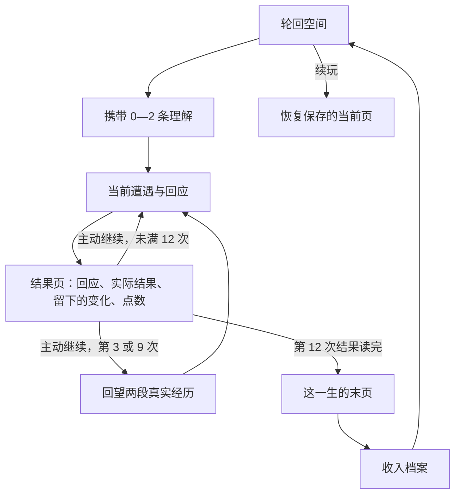

# 《轮回》产品与实现设计

当前实现基线：规则 7、存档 v3；于 2026-09-08 对照工作区代码核对。引擎为 Cocos Creator 3.8.8，设计分辨率 720 × 1280。本文取代早期计划中的回合数、事件规模和界面流程。分层、数据流、存档边界和开发入口详见 [项目架构](docs/PROJECT_ARCHITECTURE.md)。

## 产品目标

你遇见的人与事会留在往后的回应里。回望时，你可以重新理解自己；早先的事实、回应和当时的理解都会保留。

一世围绕信任与自我保护、离开与归属、价值与被需要三个主题中的两条展开。跨世带走的是有真实来源的理解与疑问。每条理解都可以翻回去看它依据了什么。

正常阅读目标为 5—10 分钟，不设置等待倒计时，也不以强制停顿延长游戏。十二个有分量的时刻、明确结果和两次回望提供阅读与思考的空间。时长目标仍需真实玩家验证。

## 单世结构

| 章节 | 年龄 | 叙事任务 |
| --- | --- | --- |
| 最初相信的事 | 8、13、17 | 具体的小事让两种回应倾向逐渐显现 |
| 走进别人的生活 | 22、29、36 | 合作、出发与自我安排产生实际代价 |
| 选择留下的重量 | 44、51、59 | 旧合作和早年的安排带着后果回来 |
| 把来路看清 | 66、73、81 | 把经验交给别人，并面对未完成与告别 |

每章三次关键遭遇。每章保证两个活跃主题各出现一次；中间两章的第三次为两主题交叉事件。童年与晚年第三次使用相关主题的另一场景。普通模板同世不重复。

内容共 30 场：每主题每章两场独立故事，共 24 场；三种主题配对在第二、第三章各有一场交叉故事，共 6 场。童年两种免费回应；之后通常三种，存疑可增加第四种具体追问。

母亲、童年朋友阿岑、周师傅、邻居林遥保持连贯的人物身份。模板中的人物占位符在进入待决状态时绑定，结果和后续说明也使用实际人物称呼。

## 状态与推进

`submitCurrentResponse(encounterId, choiceId)` 只结算当前回应，进入 `showing-result`。`continueCurrentResult(resultId)` 才进入下一次遭遇、回望或收束。结果页保存完整快照，重启不会换结果、重复扣点或跳过阅读。

`submitCurrentRecall(recallId, stance)` 新增理解版本，补充人生点并进入下一时刻。`archiveCurrentLife()` 合并档案、标记 settled，可重试；不会自动开启下一世。命令绑定真实待决实例，失效按钮不能消费另一个事件。

## 经历与后果

每枚碎片记录发生了什么、我怎样回应、我当时怎样理解、后来怎样发展，以及人物、年龄、消费、标签和来源实例。

外部因果与心理联想分开：

- 延迟后果使用 `triggerSourceIds`。例如年轻时如何处理漏单，决定后来合作的场景变体；新结果会追加到原碎片的“后来”里。
- 心理联想使用 `recalledFragmentIds`。同一主题唤起早年的经历、最近一次经历，以及相关的前世来源；联想本身不声称造成了外部事件。
- 当时的理解使用 `understandingId`，可继续追溯其证据和此前版本。

信任、归属、价值各有一条延迟兑现链：旧订单 → 老客户；年轻时的去留 → 家中照料；加单与作品 → 中年的托付。条件变体读取真实已发生的事实。未能兑现的安排在末页说明。

## 人生点与理解

开局 2 点、上限 4 点，两次回望各补 1 点。尝试不熟悉的回应需要 1 点，主动组织或争取机会需要 2 点。始终至少保留两种有代价但不耗点的回应。

过去试过类似做法的经历，也能为相关回应提供支持，免除 1 点突破成本；支持依据会显示对应的碎片来源。

点数支付的是尝试的心力。买家可能拒绝新版本，朋友可能没法赴约；不会因为支付点数就保证好结果。结果页明确展示实际回应与点数余额。

回望出现在第 3、9 次结果读完之后。第一次选择两个同主题的真实片段，理解起点由早先实际回应决定；第二次保留早期片段，补入最新的同主题证据。六种理解各有早期与中后期文本，后一次修订不会机械重复早先的句子。

| 回望选择 | 后续作用 |
| --- | --- |
| 保留已有理解 | 保留已有行为依据；若此前已修订，继续保留该修订带来的支持 |
| 修订理解 | 对应主题中相关的协商回应免除 1 点突破成本，并显示证据来源 |
| 留下疑问 | 在相关场景增加具体的免费追问，可以暂缓承诺，也会留下尚未完成的安排 |

三种选择补点相同。新的理解以版本追加，不修改以前碎片的事实或理解。旧疑问和待续谈话仍可在末页与手记查看。

每世最多携带两条理解，来源片段一并带入。前世往事标明前世，不把不同人生中同名角色视为同一人。若同主题携带两条，后选的一条作为当前行动理解；界面说明这一规则，两条证据均保留。

本世的两条主题仍由开局随机选择，不由携带内容指定。回望的证据配对和理解文本由系统提供，玩家选择保留、修订或存疑；当前没有自由拼接经历或编写理解的操作。

## 界面规范

页面统一为页眉、简洁插画、可滚动正文和固定操作区。正文左对齐，叙事不截字，按字宽和换行测量卡片高度。文本默认 30 设计像素、行高 44；辅助文字 24/34。点击区域按视口缩放保证至少 44 屏幕像素。

选择卡片显示回应、可能放下什么、人生点成本和实际支持理由。卡片本身负责选择，确认按钮负责提交。来源链接独立于卡片，不嵌套按钮。相同页面重绘保留滚动位置；新遭遇使用新的页面身份。

结果页展示“你的回应 / 接着发生了什么 / 留下的变化”，可直接翻看已生成碎片。回望完整展示两段事实、实际回应及后果，再呈现三种理解。人生手记列出当前与全部已归档人生，按年龄排列所有经历和理解版本。追溯使用实际调用路径逐层返回。遮罩弹窗阻止点击穿透。

## 实现与存档

| 层 | 位置与职责 |
| --- | --- |
| 页面调度 | `GameApp.ts`：绑定实例、命令与返回路径 |
| 应用服务 | `app/gameService.ts`：校验、状态保存、档案查询 |
| 展示数据 | `app/presentation/`：完整文案、页面路由、卡片测量 |
| 规则引擎 | `core/lifeEngine.ts`：四章调度、结果、回望、追溯与归档 |
| 生活状态 | `core/lifeWorld.ts`、`lifeMarks.ts`：事实、关系、年度变化与初始气质 |
| 内容 | `content/storyContent.ts`：30 场遭遇、24 个具体追问、理解文本与后果链 |
| 存档 | `core/saveMigration.ts`、`platform/cocosSaveStore.ts`：v3 解析与本地读写 |
| 绘制 | `ui/`：Cocos 控件、场景、排版与滚动 |

纯领域层不依赖 `cc`、DOM 或微信 API。随机状态显式保存。跨 Cocos 编译边界使用 `Array.from(Set/Map.values())`，避免当前工具链把可迭代对象展开编译成 `concat(iterator)`。

存档仍用 `reincarnation-life.save.v3`。较早规则的有效 v3 进行中人生保留已有事实，清除并重建待决状态，过滤失效的后续模板。v1/v2/backup 三个旧键沿用原清理规则，其他应用数据不动。

重启先进入轮回空间，点击续玩恢复已保存的遭遇、结果或回望进度。未确认的选项、滚动位置和来源浏览返回路径仅保存在运行内存中。

## 验收与发布

- `npm test`：内容覆盖、3000 局模拟、12 次结果、81 岁收束、两次真实回望、同事件不同过去、理解分歧、零点、存档、失效命令、跨世来源、归档及排版几何。
- `npm run build:web`：Cocos 压缩构建后自动执行 `scripts/verify-release.cjs`，直接运行发布包里的核心模块，验证 100 局完整人生及存档/携带。
- `npm run test:release`：对现有 Web 发布包单独运行相同检查。
- `npm run build:wechat`：本地生成微信小游戏工程；模块配置包括 UI、Graphics、Mask、Tween。
- 浏览器检查实际首屏、滚动、确认、结果、回望、手记、重载、跨世携带与手机尺寸。微信真机体验另行验收。

历史模式内容保留但入口隐藏。本轮不引入网络生成、等级、装备、在线账号、广告或内购。
