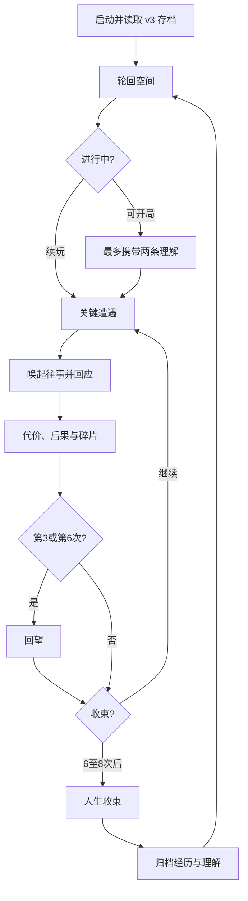
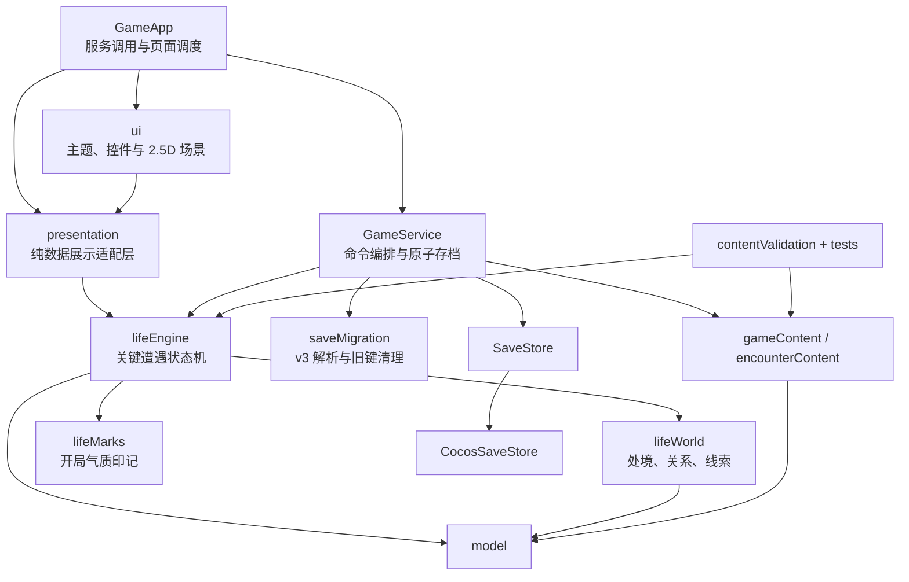

# 《轮回》（暂定名）产品与实现设计

- 文档状态：当前实现基线
- 项目版本：0.3.0
- 规则版本：6
- 存档版本：3
- 更新日期：2026-09-06
- 引擎：Cocos Creator 3.8.8
- 首发平台：微信小游戏
- 验证平台：浏览器预览
- 设计分辨率：720 × 1280 竖屏

## 1. 产品定位

### 1.1 一句话定位

一款以轮回为框架的人生叙事游戏：你经历了什么，影响你怎样回应；而新的回应，又会改变你对往事和自己的理解。

核心承诺是：**经历会留下，理解可以改口，事实不会被覆盖。**

### 1.2 玩家身份与体验目标

玩家不是某一世的角色，而是不断转世的轮回者。每一世拥有独立的家庭、先天气质、处境和经历；跨世带走的不是经验等级或装备，而是经过检验的理解及其真实来源。

产品同时提供两种满足：

- 单世叙事：在 5—10 分钟、6—8 次关键遭遇里做出有代价的回应，并在两次回望中整理理解。
- 长线变化：档案合并重复发现，下一世最多携带两条理解或疑问，让相同的外部遭遇唤起不同的往事。

### 1.3 核心差异

- 不是逐年点击或固定情景刷回合，而是略过普通年月，只在关键遭遇停下。
- 随机负责“遇见什么”，玩家负责“如何应对”；选择留下可追溯的经历碎片。
- 人生点把理解转化为行动余地：突破惯常反应或主动争取机会，花点不保证成功。
- 回望可以坚持、修正或存疑，三者获得相同人生点；修正保留旧事实和旧理解版本。
- 不引入经验、等级、传承装备、抽卡、体力或强制社交。

### 1.4 当前内容规模

| 内容 | 当前数量 |
| --- | ---: |
| 家庭 | 5 |
| 先天气质 | 4 |
| 关键遭遇模板 | 24 |
| 其中主题节点 | 3 × 6 |
| 跨主题事件 | 6 |
| 理解种子 | 6 |
| 历史地域 / 人物 | 4 / 12（入口隐藏，内容保留） |

三个主题：信任与自我保护、离开与归属、价值与被需要。每世展开其中两条交叉人生线。

## 2. 核心设计原则

1. **选择必须改变处境、关系、承诺或未来机会。** 不允许占位文本或全选项同结果。
2. **选择必须留下可追溯碎片。** 区分“这件事为什么发生”和“它为什么让我想到过去”。
3. **关联指向真实实例。** 后续事件引用遭遇实例和碎片 ID，不用相似文案或共用选项 ID 假装因果。
4. **来源实例与收藏去重分开。** 合并发现时不得把不同人生中的人物和事件混为同一实例。
5. **随机必须可复现。** 同一种子和选择序列产生同一结果。
6. **消费、回望和归档必须幂等。** 重复提交不能多扣点、多发点或重复增加收藏。

## 3. 完整业务流程



### 3.1 启动与轮回空间

1. 读取 v3 本地存档。启动时只删除本游戏的 `reincarnation-life.save.v1`、`reincarnation-life.save.v2`、`reincarnation-life.save.backup` 三个旧键；不迁移旧进度，不清空其他存储，不删除有效 v3。
2. 主页展示经历档案、已有理解和进行中人生。历史模式入口隐藏。
3. 存在进行中人生时只能续玩；存在待归档人生时必须先收入档案。

### 3.2 开局

1. 可从档案中选择 0—2 条理解或疑问，连同其来源碎片带入；可以不带。
2. 按权重生成家庭，再生成先天气质。二者留下可追溯的光环、行囊或负累，作为初始条件。
3. 从三个主题中确定本世两条交叉人生线。
4. 人生点开局 2、上限 4，不跨世结转。携带理解不增加初始财富、成功率或点数上限。
5. 跳到约 8 岁的第一次关键遭遇，先保存待决状态再展示。

### 3.3 单世节奏

正常每世 6—8 次关键遭遇，第 3、6 次回应后各一次回望。第 6 次回应后的回望先于最终归档。普通年月通过短叙述跨过，跳过的年份仍推进关系与处境。取消逐年死亡抽签；终局由故事结果或晚年收束产生。

推进优先级：

1. 兑现已安排的后果。
2. 处理两条人生线的冲突。
3. 引入符合当前处境的新遭遇。

普通模板同世不重复。已经安排却未能发生的后果，必须在收束时说明，不能静默丢弃。

### 3.4 关键遭遇与人生点

每次遭遇提供 2—4 个选项，至少两个免费。付费选项：

| 项目 | 规则 |
| --- | --- |
| 突破惯常反应 | 消耗 1 点 |
| 主动争取机会 | 消耗 2 点 |
| 回望 | 每次 +1 点，每世两次 |
| 零点 | 仍可继续，不能超支 |
| 花点 | 不保证成功 |

选项是否受某段经历支持、突破需要多少点，由内容规则声明。界面显示具体依据。条件不成立的机会不能靠支付点数凭空产生。点数不足时选项仍可见，并说明原因。

待决状态保存遭遇实例、人物绑定、选项、点数成本、引用碎片和随机状态。查看档案和因果详情不消耗点数、不推进时间、不改变随机状态。

### 3.5 经历碎片与回望

每次关键遭遇形成一枚碎片，记录：发生了什么、我怎样回应、我当时怎样理解、后来发生了什么。碎片自动记录，不消耗，也不通过重复刷取升阶。

回望取出有关联的真实碎片，提出有证据支撑的理解。玩家可以坚持、修正或存疑。修正通过新增版本完成，旧事实保留。新玩家没有跨世理解时也能完成第一次回望。

### 3.6 归档与下一世

收束展示：哪些经历塑造了你、你改变了什么、哪些问题仍未解决、哪些安排未能发生。归档后碎片和理解进入档案；重复发现按内容标识合并展示，同时保留实际来源链。下一世携带的理解提供新的回应和追问。

## 4. 实现架构

### 4.1 分层与依赖



依赖规则：

- `core/` 不引用 `cc`、`window`、`document` 或微信 API，可在 Node.js 中独立测试。
- 内容层只依赖领域模型，使用本地编写的配置和文本，不接入在线模型。
- 应用层是唯一的业务命令入口和存档事务边界。
- 界面只提交命令和渲染返回状态。
- 历史人物原文和相关视觉资源保留为未启用内容，不等于保留旧引擎。

### 4.2 代码职责

| 路径 | 职责 |
| --- | --- |
| `assets/scripts/GameApp.ts` | 启动、调用 GameService、按状态调度页面 |
| `assets/scripts/app/presentation/` | 视觉配置与纯数据展示模型 |
| `assets/scripts/ui/` | 主题、通用控件、2.5D 矢量场景与页面渲染 |
| `assets/scripts/app/gameService.ts` | 校验命令、组合领域函数、原子保存 |
| `assets/scripts/core/model.ts` | 存档、档案、人生、遭遇、碎片、理解的类型 |
| `assets/scripts/core/lifeEngine.ts` | 开局、遭遇生成、回应、回望、归档、因果查询 |
| `assets/scripts/core/lifeWorld.ts` | 生活世界突变、年度漂移与领域压力 |
| `assets/scripts/core/lifeMarks.ts` | 开局光环、行囊、负累 |
| `assets/scripts/core/random.ts` | 显式状态的确定性随机 |
| `assets/scripts/core/saveMigration.ts` | v3 解析与三个旧键清理 |
| `assets/scripts/core/contentValidation.ts` | 模板数量、免费选项、后果、引用与回望来源 |
| `assets/scripts/content/encounterContent.ts` | 24 个关键遭遇、理解种子与气质 |
| `assets/scripts/content/historyContent.ts` | 未启用的历史人物与地域 |
| `assets/scripts/platform/cocosSaveStore.ts` | v3 本地存档与旧键清理 |
| `tests/run-tests.ts` | 领域、内容、应用、展示层与 1000 局模拟 |

### 4.3 领域命令

| 命令 | 前置状态 | 结果及存档点 |
| --- | --- | --- |
| `startNewLife` | 无进行中人生、无待归档 | 创建 `active + awaiting-response` 并保存首个遭遇 |
| `submitCurrentResponse` | `active + awaiting-response` | 校验实例 ID、点数和条件，生成碎片；或进入回望 / 收束 |
| `submitCurrentRecall` | `active + awaiting-recall` | 新增理解版本并发点，随后继续或收束 |
| `archiveCurrentLife` | `awaiting-archive` | 合并发现，进入 `settled`；重复调用不重复入档 |
| `inspectCausality` | 任意 | 只读追溯，不写存档、不改随机 |

提交携带当前遭遇或回望 ID。已处理的 ID 再次提交返回当前状态，不重复扣点或发点。

### 4.4 存档版本

| 用途 | 本地键 |
| --- | --- |
| 当前存档 | `reincarnation-life.save.v3` |
| 启动时删除 | `reincarnation-life.save.v1`、`v2`、`backup` |

不生成纪念档案或旧数据备份。无法解析的 v3 原文保留在原键，内存中开一份新档案，直到下一次成功保存才覆盖。

### 4.5 界面状态

`GameApp` 调度：

- 轮回空间（档案、理解、续玩或开局）
- 携带理解（0—2 条，可跳过）
- 关键遭遇（处境、人生点、2—4 个回应、可展开的往事依据）
- 回望（坚持 / 修正 / 存疑）
- 因果详情（从遭遇打开过去记录并返回待决状态）
- 人生收束与归档
- 错误恢复页

保留 720×1280 竖屏、2.5D 场景、年龄人物、可展开短叙事和通用控件。旧资源面板、天赋、传承、历史入口和情景回合不再出现在新流程中。结算提交加锁。

## 5. 质量保障

### 5.1 内容启动校验

- 家庭、气质、遭遇、理解种子和印记 ID 唯一。
- 恰好 24 个遭遇：三主题各六节点，另加六个跨主题事件。
- 每个遭遇 2—4 个选项，至少两个免费；每个结果改变世界并写出后续可见后果。
- 安排引用必须指向已有模板，且不能指向自身。
- 回望种子必须同时具备坚持、修正和存疑文本。

### 5.2 自动化验证

```powershell
npm test
```

测试覆盖：内容结构、经历改变回应、不同回应的后果、理解修订、人生点与重复提交、归档去重、因果图与待决重载、跨世来源、旧三键清理、展示层选项完整性，以及 1000 局确定性模拟（无死路、无普通模板同世重复、每世两次回望）。

### 5.3 启动、预览与构建

```powershell
npm run cocos
npm run build:web
npm run build:wechat
```

纯领域逻辑不依赖 Cocos Creator；场景导入、引擎打包和 Web/微信 Release 仍需要本机 3.8.8。构建脚本、模块裁剪和产物路径与既有工具链相同。微信真机验收不能由 Web 检查代替。

## 6. 当前版本边界

当前版本完成单机核心闭环，不包含：

- 经验、等级、传承装备、三选一发奖、固定情景刷回合和阶段志向。
- 历史模式可玩流程（人物与美术保留为未启用内容）。
- 微信登录、云存档、排行榜或多人系统。
- 广告、内购、抽卡、签到、体力或多种可兑换货币。
- 在线生成文本或更换引擎。
- 微信开发者工具预览、上传、审核与真机发布验收。

后续内容扩展应继续使用现有配置与校验机制；接入微信能力时，应优先增加平台适配层，不把平台 API 引入纯领域层。
