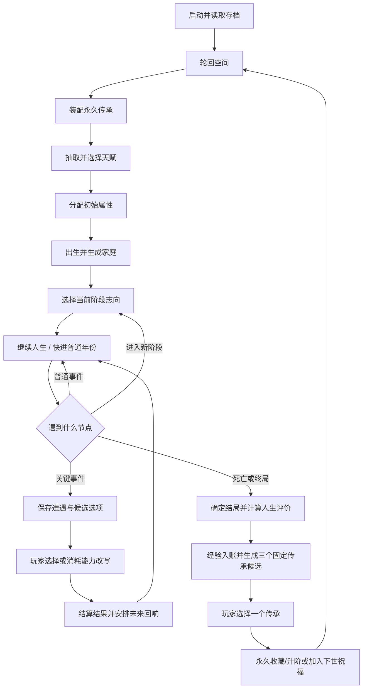
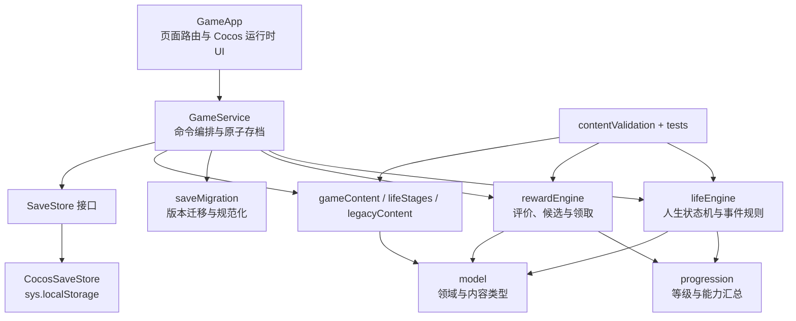

# 《轮回》（暂定名）产品与实现设计

- 文档状态：当前实现基线
- 项目版本：0.2.0
- 更新日期：2026-09-04
- 引擎：Cocos Creator 3.8.8
- 首发平台：微信小游戏
- 验证平台：浏览器预览
- 设计分辨率：720 × 1280 竖屏

## 1. 产品定位

### 1.1 一句话定位

一款带有 Roguelite 式永久构筑的人生重开文字游戏：玩家以轮回者的身份经历一世又一世，在关键人生节点亲自选择，并把每一世留下的传承带入未来。

核心承诺是：**这一世可以失败，但不会白活。**

### 1.2 玩家身份与体验目标

玩家不是某一世的角色，而是不断转世的轮回者。每一世拥有独立的家庭、天赋、属性、经历和结局；轮回经验、传承收藏及内容发现则跨越人生永久保留。

产品同时提供两种满足：

- 单世叙事：观察随机命运，并在阶段方向和关键遭遇中表达自己的意图。
- 长线成长：收集、升阶和装配传承，让下一世出现新的开局方式、选择权和故事路线。

### 1.3 核心差异

- 不是逐年机械点击，而是连续略过普通年份，在真正需要参与的时刻停下。
- 随机负责“遇见什么”，玩家负责“如何应对”，选择会形成即时结果和数年后的回响。
- 局外成长不只是数值变大；事件改写、结果预见、路线选项、故事解锁和下世祝福会改变操作方式。
- 早逝或普通结局仍能获得进度，特殊经历则会影响结算时出现的传承候选。
- 不引入多套通用货币、抽卡、体力或强制社交压力，保持规则清楚、单局轻量。

### 1.4 当前内容规模

| 内容 | 当前数量 |
| --- | ---: |
| 人生阶段 | 6 |
| 阶段志向 | 18 |
| 天赋 | 10 |
| 家庭 | 5 |
| 人生事件 | 46 |
| 关键抉择事件 | 14 |
| 结局 | 10 |
| 轮回等级 | 6 |
| 轮回传承 | 15 |

## 2. 核心设计原则

1. **选择关键时刻，不选择每一年。** 年龄仍逐年计算，但一次操作最多自动处理三个没有决策的年份。
2. **选择必须改变规则状态。** 每个选项至少改变属性、标签、后续事件、可用路线或结局条件之一。
3. **选择必须留下可追溯痕迹。** 历史记录保存事件、选项、结果及其因果来源。
4. **永久成长优先增加可能性与控制力。** 纯数值奖励受到槽位、等级和最大阶数约束。
5. **随机必须可复现。** 同一种子、能力快照、志向和选择序列产生同一结果。
6. **关键发奖必须幂等。** 经验入账与传承领取分别记录，重复请求不能重复获得收益。

## 3. 完整业务流程



### 3.1 启动与轮回空间

1. 优先读取 v2 本地存档；只有不存在 v2 时才读取并迁移 v1。
2. 无法识别或解析失败的原始存档写入备份键，不静默丢弃。
3. 轮回空间展示等级、经验进度、初始加成、传承槽位、已装备传承和待生效祝福。
4. 存在进行中人生时只能续玩；存在待选奖励时必须先领取；其余状态可配置传承并开始下一世。

### 3.2 开局构筑

开局顺序固定为：

1. 在非人生进行状态下装配永久传承。基础槽位为 2，轮回 5 级后为 3。
2. 从当前等级与能力允许的天赋池中生成确定性的候选，玩家选择 2 项。
3. 分配全部初始属性点。四项属性基础值均为 2，可分配点数基础为 10，再叠加等级和传承效果。
4. 按权重生成家庭，合并家庭、天赋和分配点数产生的属性与标签。
5. 把已装备传承和下世祝福汇总为本世不可变的能力快照；下世祝福随后从永久档案中消费。
6. 创建唯一人生编号，年龄设为 0，进入童年的志向选择并立即保存。

### 3.3 六个人生阶段

| 阶段 | 年龄 | 志向方向 | 主要影响 |
| --- | --- | --- | --- |
| 童年 | 0—11 | 好奇、伙伴、户外 | 启蒙、关系、健康事件权重 |
| 少年 | 12—17 | 学业、朋友、技能 | 学习、友情、手艺路线 |
| 青年 | 18—29 | 稳定、远行、冒险 | 职业、迁居、风险路线 |
| 壮年 | 30—49 | 事业、家庭、自我 | 创造、成家、学习与转型 |
| 中年 | 50—64 | 健康、改变、照护 | 健康、第二事业、家庭关系 |
| 晚年 | 65—100 | 留下、探索、安享 | 传承、远行、回忆与收束 |

每个阶段只能选择一次志向。志向立即增加少量属性，并通过偏好主题或能力标签改变这一阶段的事件权重和可用选项。进入下一阶段前系统必定暂停，不能由自动快进替玩家选择。

### 3.4 人生推进

人生进行时有三个交互状态：

| `turnState` | 含义 | 允许操作 |
| --- | --- | --- |
| `awaiting-focus` | 等待当前阶段志向 | 选择该阶段三个志向之一 |
| `ready` | 可以继续推进 | 继续人生或快进至下一个参与点 |
| `awaiting-choice` | 已锁定关键遭遇 | 选择应对方案，或在允许时改写遭遇 |

`advanceToNextMoment` 每次最多处理三个普通年份。每一年依次执行：

1. 增加年龄并确认是否进入新阶段。
2. 清理过期安排，优先触发处于年龄窗口内的后续回响。
3. 按年龄、等级、属性、标签、天赋、历史、阶段志向与能力标签筛选事件。
4. 避免普通随机池连续重复上一事件，并按志向及传承偏好调整权重。
5. 普通事件立即应用；关键事件只生成并保存 `PendingLifeDecision`，等待玩家输入。
6. 应用衰老效果、属性变化与新增标签，随后进行死亡和终局判定。

“快进至抉择”只重复上述安全推进，并在阶段志向、关键选择或人生结束时自动停止。

### 3.5 关键抉择与未来回响

关键事件提供 2—4 个满足当前条件的选项。每个选项包含结果方向说明和一个或多个带权重的结果。结果可以：

- 改变四项属性。
- 添加路线或经历标签。
- 安排一个未来年龄窗口内必定优先检查的事件。
- 直接触发终局。

待决策状态会保存事件 ID、可选项 ID、随机状态和已改写事件列表，因此退出再进入不会刷新候选。结果历史保存 `choiceId` 和 `outcomeId`；后续事件保存 `causedByChoiceId`，用于解释“这件事源于哪次决定”。

### 3.6 命运干预

本世能力来自开局时保存的 `RunCapabilities`：

- 事件改写：消耗次数，把尚未选择的普通关键遭遇换成同年龄的其他可用遭遇；由过往选择产生的回响不可改写。
- 结果预见：在选项文本中显示更完整的属性变化范围。
- 免死保护：第一次满足条件的体魄归零或随机死亡保留 1 点体魄。
- 负面减免：下一世第一次负面属性变化的每个负值减轻 1 点。
- 路线与故事能力：提高主题事件权重，或解锁带指定能力标签的选项和隐藏内容。

所有强能力都按本世次数或装备槽位约束，不能完全消除死亡风险或保证指定结局。

### 3.7 人生结束与结算

人生可因事件终局、体魄归零、逐年死亡概率或 100 岁终局结束。结局按优先级依次匹配年龄、最终属性和经历标签。

当前评价与经验规则为：

```text
人生评价 = 年龄 × 2
         + 四项非负属性之和 × 3
         + 不重复经历标签数 × 5
         + 已完成关键选择数 × 4

轮回经验 = 10 基础经验
         + floor(人生评价 / 10)
         + 首次发现结局时的 20 经验
```

结算拆成两笔独立事务：

1. `prepareSettlement` 通过人生编号检查 `settledRunIds`，只入账一次经验，并生成、保存三个传承候选；状态进入 `reward-pending`。
2. `claimLegacyReward` 通过人生编号检查 `rewardedRunIds`，只允许领取候选中的一项；领取后状态进入 `settled`，才允许开始下一世。

### 3.8 轮回等级与传承

轮回等级提供稳定解锁：

| 等级 | 累计经验 | 主要解锁 |
| ---: | ---: | --- |
| 1 | 0 | 基础轮回系统 |
| 2 | 50 | 初始属性点 +1、预见类传承 |
| 3 | 130 | 路线传承、下世顺风 |
| 4 | 250 | 天赋候选 +1、稀有内容与故事传承 |
| 5 | 420 | 永久传承槽位 +1 |
| 6 | 650 | 晚成路线及高阶内容 |

人生传承是每世三选一的差异化构筑：

| 类别 | 持久方式 | 当前作用 |
| --- | --- | --- |
| 出身 | 永久、可升阶、需装备 | 增加初始属性点或天赋候选 |
| 命运 | 永久、可升阶、需装备 | 改写遭遇、预见结果、抵挡死亡 |
| 道路 | 永久、需装备 | 强化学习、手艺、家庭、远行、职业或健康路线 |
| 故事 | 永久、需装备 | 解锁隐藏记忆选项和特殊结局线索 |
| 下世祝福 | 领取后仅下一世生效 | 负面减免、额外属性点或额外改写次数 |

候选生成使用本世最终随机状态、人生编号、年龄、结局和经历标签，结果确定且重进不变。系统优先考虑与本世相关的传承、尽量覆盖不同类别，并排除已满阶永久传承和当前已排队的重复祝福。

## 4. 实现架构

### 4.1 分层与依赖



依赖规则：

- `core/` 不引用 `cc`、`window`、`document` 或微信 API，可在 Node.js 中独立测试。
- 内容层只依赖领域模型，不依赖界面或存档。
- 应用层是唯一的业务命令入口和存档事务边界。
- 平台层实现 `SaveStore`，领域逻辑不知道数据最终来自浏览器还是微信小游戏。
- 界面只提交命令和渲染返回状态，不直接修改档案或人生对象。
- 当前规模不引入事件总线或通用依赖注入框架，使用明确函数调用和不可变状态返回值。

### 4.2 代码职责

| 路径 | 职责 |
| --- | --- |
| `assets/scripts/GameApp.ts` | 启动应用、页面切换、运行时创建 Cocos 标签/按钮/面板、处理自动快进 |
| `assets/scripts/app/gameService.ts` | 校验命令顺序、组合领域函数、在每个关键状态后原子保存 |
| `assets/scripts/core/model.ts` | 存档、档案、人生、事件、阶段、结局和传承的类型定义 |
| `assets/scripts/core/lifeEngine.ts` | 开局、阶段志向、事件筛选、关键选择、回响安排、死亡及结局 |
| `assets/scripts/core/rewardEngine.ts` | 人生评价、经验结算、传承三选一与领取幂等 |
| `assets/scripts/core/progression.ts` | 等级收益、传承槽位、能力聚合和档案规范化 |
| `assets/scripts/core/random.ts` | 显式状态的确定性随机、权重抽取与无重复采样 |
| `assets/scripts/core/saveMigration.ts` | v1/v2 存档迁移与缺省字段补齐 |
| `assets/scripts/core/contentValidation.ts` | 内容 ID、阶段覆盖、事件选项、安排引用和年龄兜底校验 |
| `assets/scripts/content/gameContent.ts` | 天赋、家庭、事件、结局和轮回等级配置 |
| `assets/scripts/content/lifeStages.ts` | 六阶段与十八项志向配置 |
| `assets/scripts/content/legacyContent.ts` | 五类十五项传承配置 |
| `assets/scripts/platform/cocosSaveStore.ts` | Cocos 本地存档、旧版本迁移入口和原始存档备份 |
| `tests/run-tests.ts` | 领域、应用、迁移、幂等和批量模拟测试 |

### 4.3 状态所有权

存档根对象 `GameSave` 只有两部分：

- `profile`：跨世永久档案，包括经验、等级、结局发现、事务编号、传承阶数、装备槽位和待生效祝福。
- `currentRun`：当前或上一世，包括随机状态、年龄、属性、历史、阶段志向、待决策事件、未来安排、能力快照、命运次数、结局和结算。

`GameService` 在内存中持有唯一 `GameSave`。每个公开命令先调用纯领域函数得到新对象，再一次性替换并保存完整根对象，避免档案与人生分别写入造成半完成事务。

### 4.4 领域命令

| 命令 | 前置状态 | 结果及存档点 |
| --- | --- | --- |
| `createTalentDraft`（编排 `drawTalentDraft`） | 无进行中人生或待选奖励 | 返回候选，不改变永久状态 |
| `startNewLife`（编排 `startLife`） | 开局选择完整 | 创建 `active + awaiting-focus` 人生并消费祝福 |
| `chooseStageFocus` | `active + awaiting-focus` | 应用志向并进入 `ready` |
| `advanceToNextMoment` | `active + ready` | 普通推进，或停在阶段、事件、结局 |
| `resolveEventChoice` | `active + awaiting-choice` | 应用加权结果与未来安排 |
| `rerollPendingDecision` | 可改写的待决策事件且次数大于 0 | 消耗一次并保存新事件候选 |
| `prepareSettlement` | `ended` | 经验入账并进入 `reward-pending` |
| `claimLegacyReward` | `reward-pending` | 领取一项并进入 `settled` |
| `toggleEquippedLegacy` | 非进行中、非待奖励 | 在槽位上限内装卸永久传承 |

### 4.5 确定性与存档恢复

- 所有随机函数显式接收并返回 `rngState`，不使用领域层全局随机数。
- 天赋、家庭、普通事件、改写事件、选项结果和传承候选均由保存的种子或随机状态决定。
- 待决策事件先保存后展示；玩家输入只引用已经保存的选项 ID。
- 传承候选在经验结算时一次生成并保存，不会因返回主页或重启刷新。
- 人生保存 `rulesVersion` 和开局等级快照，进行中不会因局外装备变化而改变规则。

### 4.6 存档版本

| 用途 | 本地键 |
| --- | --- |
| 当前存档 | `reincarnation-life.save.v2` |
| 旧存档读取 | `reincarnation-life.save.v1` |
| 迁移或解析失败备份 | `reincarnation-life.save.backup` |

v1 迁移保留档案经验、结局发现及当前人生的年龄、属性、标签和历史，同时推导阶段、初始化能力与新事务字段。迁移成功后写入 v2，并移除旧键；迁移或解析失败时先把原文保存到备份键，再初始化一份可运行的新档案。

### 4.7 界面状态

`GameApp` 当前按状态创建以下运行时页面，不需要手工绑定场景控件：

- 轮回空间
- 天赋选择
- 初始属性分配
- 阶段志向
- 人生推进
- 关键抉择
- 人生结算
- 传承三选一
- 传承装配
- 错误恢复页

界面设计使用 Cocos 原生 `Graphics`、`Label` 和 `Button`，不依赖图片素材；所有页面共享纸张、墨色和朱红色视觉语言。

## 5. 质量保障

### 5.1 内容启动校验

`GameService` 初始化时验证：

- 天赋、家庭、事件、结局、阶段和传承 ID 唯一。
- 六个阶段从 0 岁连续覆盖到 100 岁。
- 1—100 岁每个年龄都有一级玩家可触发的兜底事件。
- 关键事件至少有两个选择，每个选择至少有一个结果。
- 未来安排引用已存在事件，且至少延迟一年。
- 一级玩家始终至少有三个可领取传承。

### 5.2 自动化验证

运行：

```powershell
npm test
```

当前测试覆盖 14 个方面，包括确定性天赋、阶段选择、关键事件暂停、选择回响、结算与领取幂等、待事件和待奖励重载、槽位限制、能力汇总、v1 迁移、内容结构以及 1000 局完整人生模拟。

### 5.3 启动与预览

```powershell
npm run cocos
```

启动脚本读取 `package.json` 中的 Creator 版本，寻找匹配的 3.8.8 编辑器并打开项目。浏览器预览已经验证开局、天赋、属性、阶段志向、普通推进、自动停在抉择以及选择结果；微信开发者工具的触摸、前后台切换和真机性能仍需发布前验证。

### 5.4 Release 构建与交付边界

项目通过 `scripts/cocos/build-release.ps1` 统一生成 Web Mobile 和微信小游戏 Release 产物：

纯领域逻辑的开发和自动化验证不依赖 Cocos Creator；场景资源处理、引擎编译和平台 Release 构建属于引擎工具链职责，仍以本机 Cocos Creator 3.8.8 为构建时依赖。

```powershell
npm run build:release   # 两个平台
npm run build:web       # 仅 Web Mobile
npm run build:wechat    # 仅微信小游戏
```

构建流程为：定位 `package.json` 指定的 Creator 3.8.8 → 执行 TypeScript 校验 → 生成带正确数据类型的临时构建配置 → 由 Creator CLI 串行构建 → 按退出码和关键文件验证产物。启动、构建脚本与版本化配置统一保存在 `scripts/cocos/`（配置位于 `scripts/cocos/configs/`）；运行时配置与日志保存在被忽略的 `temp/release-build/`，最终产物保存在被忽略的 `build/web-mobile/` 和 `build/wechatgame/`。

两个目标均关闭 Debug 和 Source Map、开启 MD5 缓存，并把 `main.scene` 固定为启动场景。引擎功能裁剪只保留 `base`、WebGL、2D、UI、Graphics 和自定义渲染管线，避免把本项目未使用的 3D、物理、Spine、粒子与音频模块带入发布包。Web 产物是可部署到静态 HTTPS 服务的网页包；微信产物是微信开发者工具可导入的小游戏工程。微信 AppID 通过 `-WechatAppId` 或 `WECHAT_APP_ID` 在构建时注入，不写入仓库。

构建、预览、上传和上线是四个不同阶段：本脚本只完成“构建”。未提供 AppID 时生成的微信工程仅用于本地检查；正式预览、上传、提交审核和发布需要真实 AppID、已登录且有权限的微信开发者工具账号，并需另外完成触摸交互、前后台切换、包体限制和真机性能验收。

## 6. 当前版本边界

当前版本完成单机核心闭环，不包含：

- 微信登录、云存档、排行榜或多人系统。
- 广告、内购、抽卡、签到、体力或多种可兑换货币。
- 大量插画、语音、复杂动画或实时操作玩法。
- 无限剧情分支和程序生成文本。
- 微信开发者工具预览、上传、审核与真机发布验收（Release 工程生成流程已具备）。

后续内容扩展应继续使用现有配置与校验机制；接入微信能力时，应优先增加平台适配层，不把平台 API 引入纯领域层。
