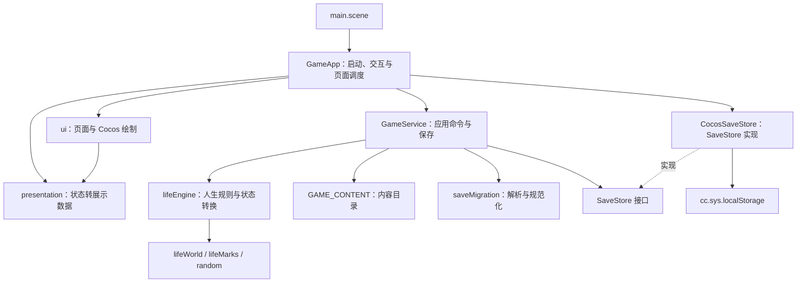
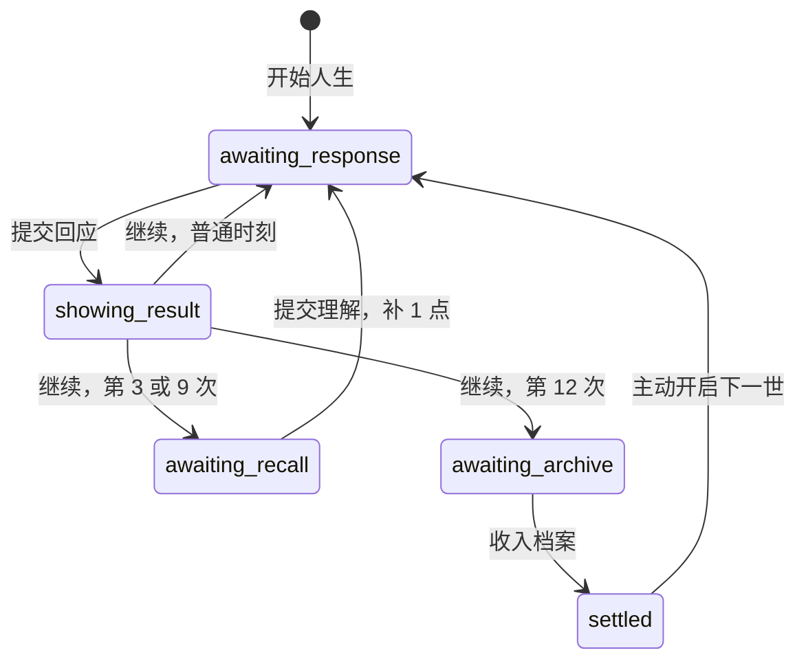

# 当前项目架构

核对日期：2026-09-08。依据当前工作区代码（包含尚未提交的改动），应用版本 `0.3.0`、规则版本 `7`、存档版本 `3`。玩法详细规则见 [Game_Design.md](../Game_Design.md)，运行与构建命令见 [README.md](../README.md)。

## 1. 项目形态

项目是 Cocos Creator 3.8.8 + TypeScript 5.8.3 的本地叙事游戏，设计分辨率为 720 × 1280，面向 Web Mobile 和微信小游戏。当前只有自由人生流程对玩家开放。

一世随机生成家庭、气质与两条主题线，玩家经历 12 个关键时刻、阅读每次回应的结果，并在两次回望中选择怎样理解经历。结束后归档，下一世最多携带两条理解及其来源。主交互是阅读、选择、确认、回望和查阅手记。

当前以单场景承载应用，页面和插画由代码在运行时创建。没有独立后端、在线账号或云存档；剧情来自本地 TypeScript 内容配置。

## 2. 分层与依赖

图中实线表示使用关系。`GameApp` 创建 `CocosSaveStore` 并注入 `GameService`；服务依赖接口，领域引擎接收 `GameContent` 参数。`core/`、`content/` 和 `app/` 不依赖 `cc`，可以在 Node.js 下测试。

| 层 | 主要文件 | 当前职责 |
| --- | --- | --- |
| 入口与控制 | `assets/scripts/GameApp.ts` | 初始化服务与 UI；选择暂存；绑定当前实例 ID；提交命令；页面切换；逐层返回；尺寸变化重绘；异常展示 |
| 应用服务 | `assets/scripts/app/gameService.ts` | 校验内容、读取存档、升级进行中的人生；开放开始/回应/继续/回望/归档命令；保存新状态；提供档案与来源查询 |
| 展示转换 | `assets/scripts/app/presentation/presenters.ts` | 把领域对象转为首页、携带、遭遇、结果、回望、末页、手记和因果详情的数据；按人生状态决定游玩页 |
| 展示结构 | `uiModels.ts`、`visualConfig.ts`、`journalLayout.ts` | 页面数据类型、场景与人物视觉配置、正文和卡片高度估算；均位于 `app/presentation/` |
| 领域模型 | `assets/scripts/core/model.ts` | 规则常量、人生与档案结构、内容配置类型、待决快照、理解与碎片类型 |
| 规则引擎 | `assets/scripts/core/lifeEngine.ts` | 开局、四章选场、冻结选项、结算结果、回望、后果调度、跨世携带、收束、归档与来源追溯 |
| 世界与状态 | `lifeWorld.ts`、`lifeMarks.ts`、`random.ts` | 事实/关系/生活线索及年度变化；初始与后续印记；可保存状态的随机抽样；均位于 `core/` |
| 内容目录 | `assets/scripts/content/` | 家庭、气质、遭遇、回应、理解种子、印记和保留的历史人物数据 |
| 校验与解析 | `core/contentValidation.ts`、`core/saveMigration.ts` | 内容覆盖与引用检查；v3 存档解析、默认值与字段规范化；旧键清理 |
| 平台适配 | `assets/scripts/platform/cocosSaveStore.ts` | 通过 Cocos 本地存储读写整个存档 JSON |
| UI 绘制 | `assets/scripts/ui/` | `pages.ts` 组合页面；`kit.ts` 创建控件、滚动、遮罩与动画；`sceneArt.ts` 用 Graphics 绘制插画；`theme.ts` 管理主题与适配 |

## 3. 状态如何流动

一次回应经过以下步骤：

1. 玩家点击选项，`GameApp.selectedChoiceId` 暂存选择，重新生成展示数据；此时不结算。
2. 玩家确认，`GameApp` 调用 `submitCurrentResponse(encounterId, choiceId)`。
3. `GameService` 检查当前人生与遭遇实例，调用 `submitResponse`。
4. 引擎检查选项及点数，根据条件与随机状态选择结果，更新世界、印记、点数账本、经历碎片和延迟安排，生成 `pendingResult`。
5. 服务将新 `GameSave` 写入存储。`routePlayPage` 将 `showing-result` 路由到结果页。
6. 玩家点击继续，`continueCurrentResult(resultId)` 才安排下一场遭遇、回望或人生收束，并再次保存。

图中状态对应代码中用连字符命名的 `turnState`。`status` 另行区分 `active`、`awaiting-archive`、`settled`，用于限制开始新人生和归档等命令。

防重复依靠 UI 的 `submitting` 标记、真实实例 ID、`resolvedEncounterIds` / `resolvedRecallIds` 以及归档 ID 去重。结果继续也校验结果实例，过期命令不会推进另一个时刻。

## 4. 关键数据模型

| 数据 | 保存内容与用途 |
| --- | --- |
| `GameSave` | 顶层保存 `version`、跨世 `profile` 和 `currentRun` |
| `LifeRun` | 当前人生的规则版本、随机状态、主题、年龄、世界、点数、碎片、理解、待决状态和收束信息 |
| `LifeWorld` | `facts` 保存事实及形成年龄；`relations` 保存人物关系、亲近与张力；`threads` 保存生活线索及强度 |
| `ExperienceFragment` | 事件原文、实际回应与结果、当时理解、后来发展、人物、点数、标签及来源 ID；`runId` 区分本世与前世 |
| `Understanding` | 理解文本、立场、实际生效立场、版本、上个版本 ID、证据碎片 ID 和产生时间 |
| `PendingEncounter` / `PendingResult` / `PendingRecall` | 保存已生成的遭遇与可选回应、结果快照或回望证据，支持退出后恢复待决进度 |
| `ScheduledEncounter` | 保存后续事件模板、兑现年龄窗口、来源事件与来源碎片 |
| `ReincarnatorProfile` | 保存归档人生 ID、全部已归档碎片与理解、按内容合并的发现，以及最后一次收束 |
| `CausalityRecord` | 按需生成的来源详情展示结构，供玩家沿 ID 查阅事件、理解及其证据 |

三种来源关系各有含义：

- `triggerSourceIds`：真实外部因果，例如年轻时的工作安排引出后来托付。
- `recalledFragmentIds`：心理联想；旧事被想起，不意味着它造成了当前外部事件。
- `sourceFragmentIds` / `previousVersionId`：理解依据的经历与此前理解版本。

回望追加理解版本；旧碎片保留当时的理解。后续事件可以向原碎片的 `laterWhat` 追加发展。档案保存完整碎片与理解，但没有为每一世保存完整 `LifeRun` 世界快照；手记根据 `runId` 分组还原人生记录。

## 5. 内容与调度

`gameContent.ts` 组装统一的 `GAME_CONTENT`：5 种家庭、4 种气质、30 场遭遇、6 种理解种子、印记，以及当前未开放的历史内容。`storyContent.ts` 是现行剧情的主要编辑入口，`encounterContent.ts` 仅保留转导出兼容入口。

开局按家庭权重、等权气质和随机的两条主题线生成状态。携带理解不会指定本世主题；相应主题出现时才有机会体现作用。

调度以 `model.ts` 的 12 个年龄和每章三场为准。每章优先补齐两条主题，中间两章再安排交叉场景；满足主题、章节和条件的到期后果优先。模板同世不重复。`EncounterTemplate.years` 虽然仍在模型中，当前推进年龄由 `MOMENT_AGES` 控制。

每个内容模板可声明人物绑定、条件变体、免费和付点回应、结果条件与权重、世界变化及后续安排。进入待决状态时冻结人物称呼、剧情和可选回应；结算后记录真实结果。已有类似经历或修订后的相关理解，可以为突破惯常反应提供支持；存疑会在童年之后的相关场景增加免费追问。

`lifeWorld` 仍维护健康、学习、关系、事业、家庭、旅行、手艺与传承等领域状态，但当前主循环按固定章节和关键时刻推进，不以这些数值随机决定寿命。

## 6. 界面与恢复边界

实际页面为轮回空间、跨世携带、遭遇、结果、回望、末页、人生手记、来源详情，以及错误页和遮罩弹窗。遭遇和回望均采用“先选择，再确认”。

UI 使用完整正文、按内容估算的卡片高度、滚动正文和固定操作区。`UiKit` 按页面身份在内存中保存滚动位置；`GameApp` 用回调保存来源浏览的返回路径。插画和人物目前主要由 Cocos Graphics 程序绘制。

自动存档保存的是游戏进度与待决快照。重新启动先进入轮回空间，点击续玩后回到对应游玩状态；未确认选择、手记浏览路径和滚动位置不写入存档。

当前存档键是 `reincarnation-life.save.v3`。旧 v1、v2、backup 三个键会被清理，不会转换成新玩法记录。较早规则的有效 v3 人生经 `upgradeActiveRun` 升级，保留已有事实，但会清除并重建待决状态，过滤失效的后续模板。

当前存储适配器没有备份恢复链：读取返回无效存档时，服务会初始化并保存新档。`load()` 中“未覆盖”的日志不能视为损坏存档受到持久保护的保证。

## 7. 开发入口与验证

| 要修改的内容 | 优先查看 |
| --- | --- |
| 剧情、选项、人物占位、理解文本和后果链 | `assets/scripts/content/storyContent.ts` |
| 家庭开局与印记配置 | `content/gameContent.ts`、`content/markContent.ts` |
| 人生点、年龄、章数、携带上限 | `core/model.ts`，同时检查 `core/lifeEngine.ts` 的调度假设及内容覆盖 |
| 回望规则、选项支持、归档与来源 | `core/lifeEngine.ts` |
| 世界事实、关系、年度变化 | `core/lifeWorld.ts` |
| 页面文案与显示字段 | `app/presentation/presenters.ts`、`uiModels.ts` |
| 卡片、按钮、滚动和插画 | `ui/pages.ts`、`kit.ts`、`sceneArt.ts`、`theme.ts`、`app/presentation/journalLayout.ts` |
| 存档字段与兼容 | `core/model.ts`、`core/saveMigration.ts`、`app/gameService.ts`、`platform/cocosSaveStore.ts` |
| 发布目标与引擎模块 | `scripts/cocos/build-release.ps1`、`scripts/cocos/configs/` |

表中省略前缀的代码路径均相对于 `assets/scripts/`。

`npm test` 对资产脚本执行严格 TypeScript 检查，再将纯逻辑编译到 `.test-dist/` 并运行 `tests/run-tests.ts`。2026-09-08 本次核对实际执行通过：9/9 组测试，包含 1000 个种子 × 3 种策略的 3000 局，覆盖全部 30 场景与 3 种主题组合。

Web 构建后，`scripts/verify-release.cjs` 可直接验证压缩产物中的核心模块，覆盖 100 局结果、存档、归档与携带。两端发布由 `scripts/cocos/` 的 PowerShell 脚本驱动，需要安装匹配版本的 Creator。构建输出位于 `build/web-mobile/`、`build/wechatgame/`。

本次仅核对源码、整理文档并运行 `npm test`，未重新构建或复验浏览器、微信真机。此前本地发布与浏览器验收记录见 [CORRECTION_REPORT.md](../CORRECTION_REPORT.md)。

## 8. 当前边界与后续判断

历史人物数据、类型和部分视觉配置仍被保留，部分随内容目录加载，但没有开放历史玩法流程。天赋抽选、传承配装、等级、装备、广告、内购和在线生成不在当前开放玩法中。

当前核心循环更接近分支互动小说。玩家可以选择预设的理解立场，但证据配对与理解文本由系统生成，尚无主动整理碎片、自由组合理解的操作。单世 5—10 分钟是阅读体验目标，仍需玩家测试。

从代码维护看，分层已经能支持独立规则测试；`lifeEngine.ts` 集中了调度、回应、回望、归档和追溯，`storyContent.ts` 集中了大部分剧情。继续扩展时可按这些职责和主题拆分文件，并维持 `GameService` 命令接口与完整人生测试。本次未改动运行逻辑。
